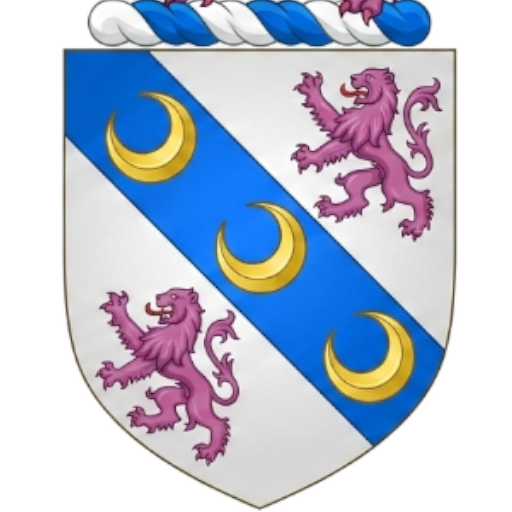

  

# 🏛️ Memórias da Família Barboza

> Um espaço digital exclusivo e afetivo para honrar o legado de **Genésio e Maria Barboza**, preservando nossa história, nossas raízes e nossas memórias para as próximas gerações.

---

## 📋 Sobre o Projeto

Este projeto consiste no desenvolvimento de uma aplicação web exclusiva (estilo *Instagram-like*) voltada para os membros da **Família Barboza**. O grande objetivo é centralizar, organizar e dar vida às fotografias e registros antigos da nossa família. 

A iniciativa nasce da necessidade de resgatar e proteger o nosso patrimônio histórico familiar, iniciando com o precioso acervo inicial do **Tio José Gomes Barboza**. Futuramente, a plataforma será aberta para que todos os demais parentes possam contribuir, enviar suas próprias fotos, comentar e enriquecer as histórias por trás de cada registro.

---

## 🛡️ Identidade Visual e Legado

O ícone oficial deste projeto é o **Brasão da Família Barboza** (imagem contida nas mídias do sistema), simbolizando a união, a força e a continuidade da nossa linhagem. Cada linha de código deste sistema carrega o respeito que temos pela história construída por nossos avós, **Genésio e Maria Barboza**.

---

## ✨ Funcionalidades Principais

* **Feed de Memórias:** Linha do tempo visual inspirada nas redes sociais modernas, facilitando a navegação pelas fotos antigas.
* **Acervo Inicial Dedicado:** Seção especial com a curadoria digital das fotos disponibilizadas pelo Tio José Gomes Barboza.
* **Contribuição Familiar (Fase 2):** Sistema de upload seguro para que outros membros da família possam enviar suas relíquias fotográficas.
* **Histórias e Comentários:** Espaço sob cada publicação para que os parentes identifiquem quem está na foto, a data aproximada, o local e compartilhem causos e memórias.
* **Ambiente Seguro e Privado:** Acesso restrito apenas para membros autenticados da família, garantindo a privacidade das nossas fotos e dados.

---

## 🚀 Tecnologias Utilizadas

O ecossistema do projeto foi planejado utilizando práticas modernas de desenvolvimento web:

* **Front-end:** Interface responsiva (Mobile-First), otimizada para que os tios, primos e avós consigam navegar facilmente pelo celular.
* **Autenticação:** Sistema de convites ou validação de sobrenome/núcleo familiar para garantir a exclusividade do ambiente.
* **Armazenamento (Storage):** Infraestrutura em nuvem otimizada para preservar a resolução original das fotos digitalizadas.

---

## 📂 Organização do Acervo

Para manter o respeito e a cronologia dos fatos, as mídias estão sendo categorizadas inicialmente por linhas temporais e núcleos:
1.  **Origens:** Registros históricos de Genésio e Maria Barboza.
2.  **Coleção José Gomes:** Arquivos digitalizados do acervo do Tio José.
3.  **Próximas Gerações:** Pastas que serão liberadas para os demais ramos da família.

---

## 🤝 Como Contribuir (Para Desenvolvedores da Família)

Se você é um desenvolvedor da família e quer ajudar a codificar essa homenagem:

1.  Faça um **Fork** deste repositório.
2.  Crie uma branch para sua feature: `git checkout -b feature/nova-funcionalidade`
3.  Commit suas alterações: `git commit -m 'Adiciona nova funcionalidade'`
4.  Faça o Push para a branch: `git push origin feature/nova-funcionalidade`
5.  Abra um **Pull Request**.

---

## 📅 Status do Projeto

- [x] Idealização e Definição de Escopo
- [x] Estruturação do Repositório e Identidade (Brasão Barboza)
- [ ] Desenvolvimento do Layout Base (Feed)
- [ ] Importação do Acervo do Tio José Gomes Barboza
- [ ] Implementação do Módulo de Comentários
- [ ] Lançamento Oficial para a Família

---

> *"Um povo que não conhece a sua história está condenado a repeti-la. Uma família que preserva a sua história garante que seu amor e valores ecoem pela eternidade."*
